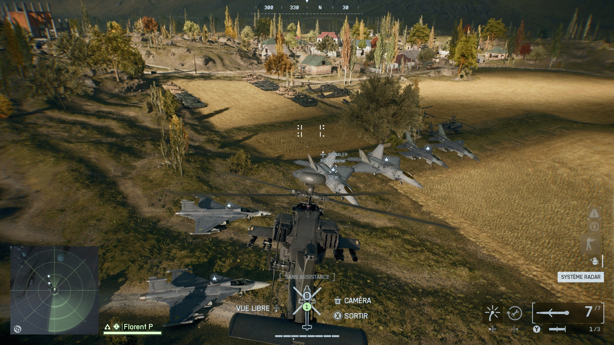

# Battlefield 6 Vehicle Training map

This repo holds the "source files" for the "**Florent's Vehicle Training**" Portal experience (code 3374).  

## Current features (for the published "v9")

- Mirak Valley
- Two or more of every vehicles on each side (except SU59 which doesn't spawn)
- Immediate player and vehicle respawn
- Infinite, no objective custom game mode
- Much bigger combat area
- No bots

## Future features (maybe)

- Bot vehicules (ground and air) that moves on predetermined paths, to use as target practice
- TOW and tank shooting range
- Infinite ammunitions
- Protection against idle players
- show position on screen
- UI to teleport
- UI to change team anytime
- UI to spawn any vehicles in front of player

## Content of the repo

- `src/MP_Tungsten_Vehicle_Training.tscn` is the map file from Godot. This the map Mirak with my stuff added. To use it, place it somewhere inside the `GodotProject` folder that came with the SDK
- `src/MP_Tungsten_Vehicle_Training.spacial.json` is matching spatial that contain all the added stuff, generated from Godot
- `experience/florent's_vehicle_training.json` is the export of the experience I created from the Portal web builder
