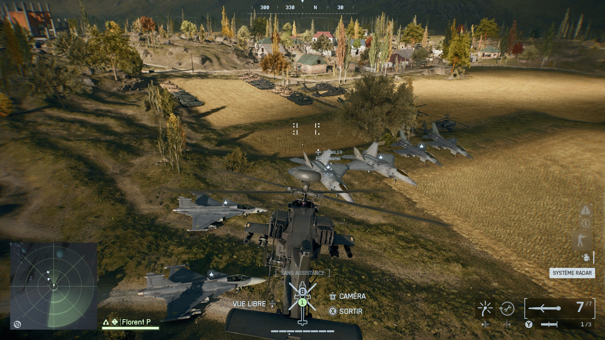

# Battlefield 6 Vehicle Training map

This repo holds the "source files" for the "**Florent's Vehicle Training**" Portal experience (code 3374).  

## Current features (for the published "v9")

- Mirak Valley
- Two or more of every vehicles on each side (except SU59 which doesn't spawn)
- Immediate player and vehicle respawn
- Infinite, no objective custom game mode
- Much bigger combat area
- No bots

## Future features (maybe)

- Bot vehicules (ground and air) that moves on predetermined paths, to use as target practice
- TOW and tank shooting range
- Infinite ammunitions
- Protection against idle players
- show position on screen
- UI to teleport
- UI to change team anytime
- UI to spawn any vehicles in front of player

